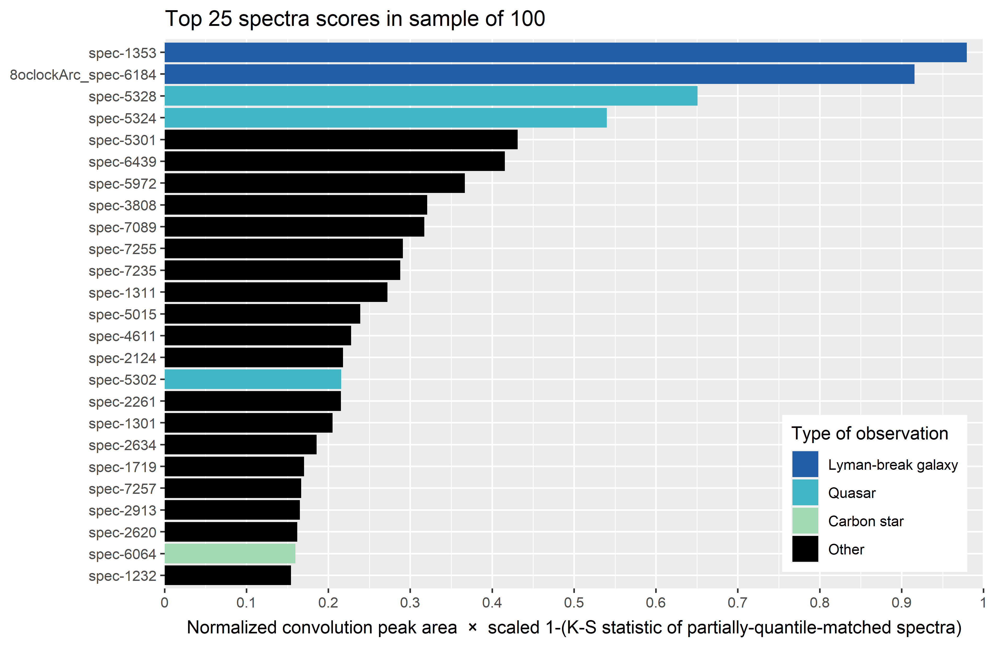

# Lyman-break galaxies

### Overview of method

 - Low-pass filter via Fast Fourier Transform used to smooth spectra
 - Convolution with template, used to:
   - correct for red-shift (horizontal translation of log-wavelength)
   - compute normalized area-under-peak to assess quality-of-match
 - Partial-quantile rescaling to match flux of spectra at computed red-shift
 - (Rescaled) Kolmogorov-Smirnov statistic used as second criterion for quality-of-match

### Results

For detailed results, see output file `res.txt`. Below is plot of top 25 scoring spectra.

### To do next

Currently awaiting further feedback on this new method.

