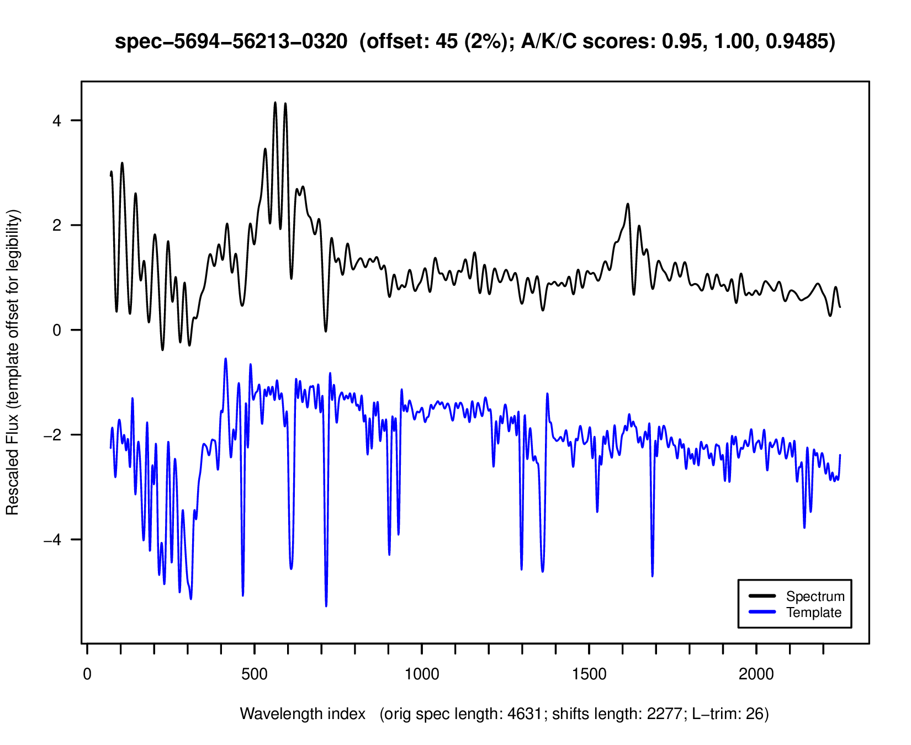

  ---
title: "Lyman-break galaxy detection"
author: "Bi Cheng Wu"
date: "`r format(Sys.Date(),'%B %e, %Y')`"
output: html_document
---

## Link

[Github project page](https://github.com/bwu62/shinys/tree/master/LymanFFT).

## Data

We aim to detect Lyman-break galaxies (LBGs) by comparing spectra against a known template. In particular, good candidates should:

1. Match key absorption troughs (nearly) exactly.
1. Not exhibit signs of broad higher-wavelength emissions (likely to be quasars).

The first requirement is easier than the second, since we are provided a high-quality LBG template to compare with. If a similarly high-quality template were to be provided for quasars, **it should be possible to substantially improve these results**.

## Considerations

> *The method started simple but grew more complex over time with testing.*

The main consideration in designing the method was robustness. Every step in the process should be as robust as possible against:

1. Noise
1. Arbitrary vertical & horizontal shifting
1. Arbitrary vertical scaling

Carefully selected smoothing methods were effective at reducing anticipated noise, convolution matching of absorption troughs was effective at correcting for horizontal shifts, and regressing on quantiles was effective at correcting vertical shifting/scaling. More details are provided below.

## Method

The process was carefully constructed and tuned with the help of several R Shiny debugging apps I made (see repo for details). Below is a more in-depth overview:

1. The spectrum is first trimmed at both ends to remove [Gibb's artifacts](https://en.wikipedia.org/wiki/Gibbs_phenomenon).
1. Then, it's *gently* [low-pass](https://en.wikipedia.org/wiki/Low-pass_filter) smoothed by truncating its [(fast) Fourier transform](https://en.wikipedia.org/wiki/Fast_Fourier_transform).
1. Next, to emphasize absorption troughs, we took the difference between the spectrum and an *aggressively* [loess-smoothed](https://en.wikipedia.org/wiki/Local_regression) version of itself.
1. This was then [convolved](https://en.wikipedia.org/wiki/Matched_filter) with a similarly trough-emphasized version of the template (cB58), which was used in two ways:
   i. First, the index of the global maximum was recorded as the [red/blue-shift](https://en.wikipedia.org/wiki/Redshift) correction (this works because the wavelength is already in log-scale).
   i. Then, the convolved result is transformed to reduce noise and emphasize potential matches. The normalized area under the index found above, called $A_{\text{peak}}$, is calculated and saved.
1. Now, we slide our template to correct for red-shift and rescale by using simple linear regression (SLR) to match fixed quantiles in the first two-thirds of both spectra.
   i. Note SLR is merely used to match points that be vertically shifted/scaled (thus, the quantiles don't even need to be linear).
   i. The first two-thirds were used since it *kind of appears* (this needs better investigation!) that quasars may have more broad emissions to the side, so matching part of the spectrum may help distinguish these cases.
1. Penultimately, we take the [Kolmogorov-Smirnov](https://en.wikipedia.org/wiki/Kolmogorov%E2%80%93Smirnov_test) difference statistic between the entirety of both spectra, and transform it into $K_{\text{trans}}$ to penalize (up to a point) spectra with higher statistic (i.e. larger difference) than a noisy version of our template.
1. Lastly, we simply take the product $C=A_{\text{peak}}\cdot K_{\text{trans}}$ as our composite score. Note both $A_{\text{peak}},K_{\text{trans}}\in[0,1]$ with higher being better.

Steps 5-6 above are kind of a hack. If we had a high-quality quasar template to match against, we may be able to replace it with more elegant code that also achieves higher specificity (this is only a conjecture).

## Results

A table of top 500 results sorted by ranked by composite score can be [viewed here](res2.txt).

Plots of some of the best matches are shown below. Most info in the title/label are for my debugging purposes. Notably, the offset index (red-shift correction) and $A_{\text{peak}}$, $K_{\text{trans}}$, and $C$ are shown in the title. The template was shifted down from the spectra for legibility.

For each spectrum, the composite score is also shown on the side for convenience. Initially, I was going to give a (likely very poor) guess for each one what type of astronomical body it may be, but I ultimately decided against it since I really have no idea 🙃

Here are the top 50 or so spectra (with a few visually ruled out). There seem to be quite a few potential quasars in here with broad emission bands CIV and CIII (some of which are quite visible).

| &nbsp; | |
| :---: | :--- |
|  | Score: $0.998173$ |
|  | Score: $0.996457$ |
|  | Score: $0.996200$ |
|  | Score: $0.993031$ |
|  | Score: $0.990401$ |
|  | Score: $0.990346$ |
|  | Score: $0.989884$ |
|  | Score: $0.988500$ |
|  | Score: $0.987187$ |
|  | Score: $0.986188$ |
|  | Score: $0.985287$ |
|  | Score: $0.984728$ |
|  | Score: $0.983821$ |
|  | Score: $0.983571$ |
|  | Score: $0.983414$ |
|  | Score: $0.982770$ |
|  | Score: $0.982456$ |
|  | Score: $0.981456$ |
|  | Score: $0.981149$ |
|  | Score: $0.978160$ |
|  | Score: $0.975860$ |
|  | Score: $0.974586$ |
|  | Score: $0.973305$ |
|  | Score: $0.972581$ |
|  | Score: $0.971594$ |
|  | Score: $0.971582$ |
|  | Score: $0.969833$ |
|  | Score: $0.969629$ |
|  | Score: $0.969139$ |
|  | Score: $0.969034$ |
|  | Score: $0.966476$ |
|  | Score: $0.964608$ |
|  | Score: $0.962382$ |
|  | Score: $0.960429$ |
|  | Score: $0.959924$ |
|  | Score: $0.959898$ |
|  | Score: $0.958947$ |
|  | Score: $0.958364$ |
|  | Score: $0.957592$ |
|  | Score: $0.955886$ |
|  | Score: $0.954140$ |
|  | Score: $0.953548$ |
|  | Score: $0.953100$ |
|  | Score: $0.952959$ |
|  | Score: $0.952637$ |
|  | Score: $0.951155$ |
|  | Score: $0.950995$ |
|  | Score: $0.949865$ |
|  | Score: $0.949348$ |
|  | Score: $0.948499$ |
